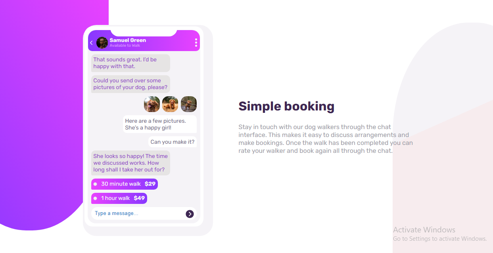

# Frontend Mentor - Chat app CSS illustration solution

This is a solution to the [Chat app CSS illustration challenge on Frontend Mentor](https://www.frontendmentor.io/challenges/chat-app-css-illustration-O5auMkFqY). Frontend Mentor challenges help you improve your coding skills by building realistic projects.

## Table of contents

- [Overview](#overview)
  - [The challenge](#the-challenge)
  - [Screenshot](#screenshot)
  - [Links](#links)
- [My process](#my-process)
  - [Built with](#built-with)
  - [What I learned](#what-i-learned)
  - [Useful resources](#useful-resources)
- [Author](#author)

## Overview

### The challenge

Users should be able to:

- View the optimal layout for the component depending on their device's screen size
- **Bonus**: See the chat interface animate on the initial load

### Screenshot




### Links

- Solution URL: [Github](https://github.com/Emmanuel-obiora/chat-app)
- Live Site URL: [Chat App](https://emmanuel-obiora.github.io/chat-app/)

## My process

### Built with

- Semantic HTML5 markup
- Css custom properties
- Sass
- Flexbox
- CSS Grid
- [React](https://reactjs.org/) - JS library

### What I learned

During the development of this project I learnt a good of ways to better use CSS and Sass properties. First, is the proper use of linear gradient in mixing multiple colors together, in terms od direction and degree. Second, is how to set a child element to a particular part of a page based on its parent settings. And lastly, improving on the use of React and its library components.

```html
  <div className="chat-images">
    
    
    
  </div>
```

```css
.toggle{
    position: absolute;
    width: 5px;
    height: 5px;
    background: $Light-Grayish-Violet;
    border-radius: 50%;
}

.toggle::before, .toggle::after{
    position: absolute;
    content: "";
    width: 5px;
    height: 5px;
    border-radius: 50%;
    background: $Light-Grayish-Violet;
}
```

### Useful resources

- [w3schools](https://www.w3schools.com/css/css3_gradients.asp) - This helped in the proper use of CSS gradient properties. I really liked the documentation and will use it going forward.

- [Tony Heimark](https://www.youtube.com/watch?v=SR8755C0bME&t=326s) - This helped in the design and creation of a loading page, the tutor is awesome.

## Author

- Website - [Obiora Emmanuel](https://emmanuel-obiora.github.io/portfolio-about-me-/web-content)
- Frontend Mentor - [@Emmanuel-obiora](https://www.frontendmentor.io/profile/Emmanuel-obiora)
- Twitter - [@Miroclesdgenius](https://twitter.com/Miroclesdgenius)
